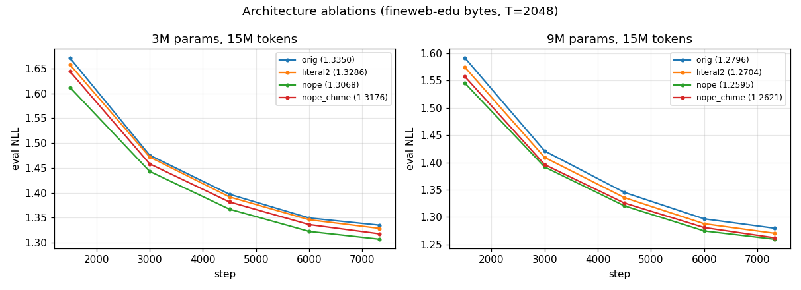
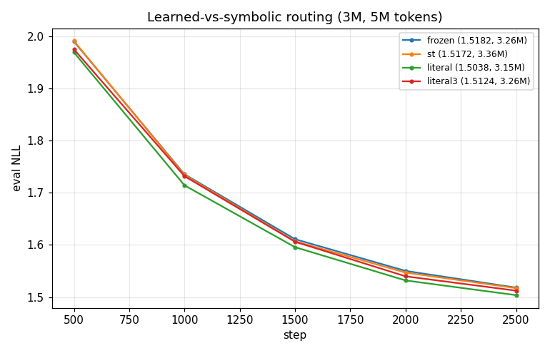
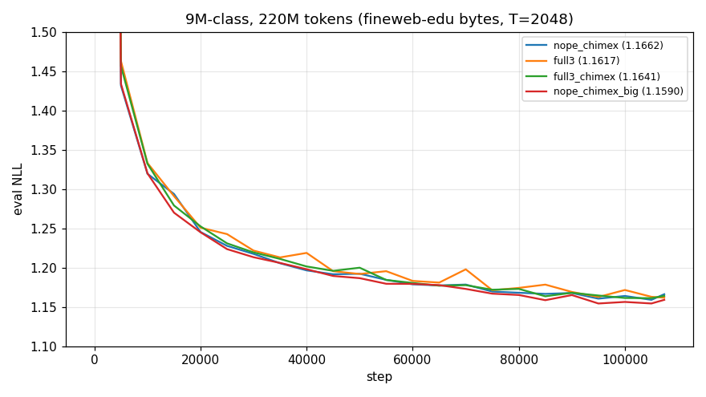
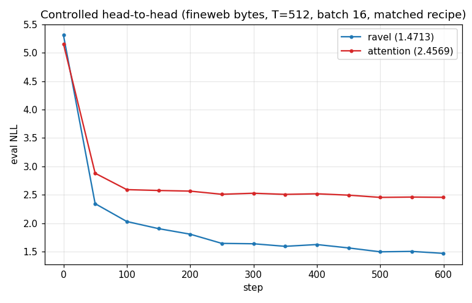
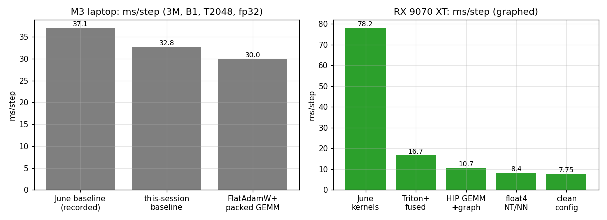

# RAVEL-LM — Experiment Log

Consolidated log of every experiment run to date: configs, methods, results, and
graphs. All language-model experiments use **byte-level fineweb-edu** (raw UTF-8,
vocab 260) unless noted. Eval NLL is mean next-byte negative log-likelihood in
**nats/byte**; `bpb = nll / ln 2`.

Corpus: `runs/fineweb_edu_3m_15m_ctx2048/{train,eval}_corpus.txt` (48.0M / 5.3M bytes).

---

## 0. TL;DR

| Question | Answer | Evidence |
|---|---|---|
| Does RAVEL beat attention at equal footing? | **Yes, ~1 nat** | Exp 5 (controlled head-to-head, tuned baseline) |
| Best architecture config? | **NoPE + 2 literal heads (+CHIME-X), no learned head** | Exp 1, 3 |
| Do learned (content) routing heads help? | **No** — symbolic beats learned; deleting the learned head *improves* NLL | Exp 1, 2 |
| Do position embeddings earn their params? | **No** — NoPE + depth wins param-matched | Exp 1, 3 |
| Does the small-scale win survive to 9M/220M? | **Yes, param-matched** (clean 1.1590 < full 1.1617) | Exp 3 |
| Does CHIME-X help at T≤2048? | Marginal (helps clean, neutral on full); its channels validated in isolation | Exp 3, 4 |
| Training-step speed | M3: 37→30 ms; RX 9070 XT: 78→7.75 ms | §6 |

**Open item:** no attention baseline has been run at 9M/220M on fineweb (only RAVEL).
The controlled win (Exp 5) is at ~3M/T512. Scaling the head-to-head is the next experiment.

---

## 1. Architecture ablations — 15M tokens (`scale_suite_results.json`)

**Method.** Four architecture variants trained at two scales, identical data order,
15M tokens (7,324 steps × B1 × T2048), fineweb-edu bytes, FlatAdamW, cosine schedule.
Variants:
- `orig` — 2 literal + **1 learned** memory head, **learned position embeddings** (the original `ravel_3m_byte` design).
- `literal2` — drop the learned head (2 literal, 0 learned); keep pos emb.
- `nope` — 2 literal, 0 learned, **NoPE** (position table frozen at 0).
- `nope_chime` — `nope` + CHIME-X v2 age gate.

Base = d_model 160, 10 layers (~3M). Big = d_model 256, 12 layers (~9M).

| variant | 3M params | 3M final NLL | 9M params | 9M final NLL |
|---|---|---|---|---|
| orig (learned head + posemb) | 3,255,840 | 1.3350 | 9,082,112 | 1.2796 |
| literal2 (drop learned head) | 3,153,440 | 1.3286 | 8,885,504 | 1.2704 |
| **nope** (drop learned + posemb) | 2,825,760 | **1.3068** | 8,361,216 | **1.2595** |
| nope_chime (+ age gate) | 2,844,960 | 1.3176 | 8,398,080 | 1.2621 |

**Findings.** Every deletion *helps*: dropping the learned head and the position
table each lowers NLL while shrinking the model, at both scales. `nope` is best of
the four; the age gate is ~neutral at this budget/context. The ranking is stable at
every checkpoint (see graph).

---

## 2. Learned-vs-symbolic routing — 5M tokens (`routing_experiment_results.json`)

**Method.** Isolate the memory routing mechanism at 3M params, 5M tokens.
- `frozen` — original: learned product-code head with frozen (random) projection.
- `st` — straight-through estimator giving the learned head real gradients.
- `literal` — 2 literal heads only (no learned head).
- `literal3` — 3 literal heads (uni/bi/tri-gram), no learned head.
- (`nope`, `nope_chime`, `chime2` also recorded — NoPE variants.)

| arm | params | final NLL | read-addr unique/layer |
|---|---|---|---|
| frozen (random learned head) | 3,255,840 | 1.5182 | ~140–238 |
| st (trainable routing) | 3,358,240 | 1.5172 | ~224–248 |
| literal (2 literal, 0 learned) | 3,153,440 | **1.5038** | — |
| literal3 (3 literal) | 3,255,840 | 1.5124 | — |
| nope | 2,825,760 | 1.4650 | — |
| nope_chime | 2,844,960 | 1.4860 | — |

**Findings.** The learned "content" head is worse than useless: `literal` (no learned
head, *fewer* params) beats both `frozen` and `st`. Straight-through gradients change
nothing (1.517 vs 1.518) despite the head using 200+ distinct addresses — it routes
plenty, just uselessly. Symbolic (n-gram) addressing carries the model. Two literal
heads beat three (capacity dilution). Among all, NoPE is the biggest single win.

---

## 3. Chinchilla-scale comparison — 9M params, 220M tokens (`run_9m_220m_results.json`)

**Method.** 4 configs at ~9M params, 220M tokens (107,421 steps × B1 × T2048),
HIP-graphed on RX 9070 XT.
- `nope_chimex` — NoPE + 2 literal + CHIME-X (8.36M).
- `full3` — 2 literal + 1 learned head + pos emb (9.08M).
- `full3_chimex` — full config + CHIME-X age gate (9.08M).
- `nope_chimex_big` — clean config scaled to full3's params via +1 layer (L13, 9.05M).

| config | params | final NLL |
|---|---|---|
| **nope_chimex_big** (clean, param-matched via depth) | 9,052,494 | **1.1590** |
| full3 (learned head + posemb) | 9,082,112 | 1.1617 |
| full3_chimex (full + CHIME-X) | 9,082,184 | 1.1641 |
| nope_chimex (clean, 0.7M fewer params) | 8,361,288 | 1.1662 |

**Findings.** *Param-matched*, the clean config wins (1.1590 < 1.1617). full3's raw
edge over `nope_chimex` was purely a 0.72M-param head start — spend those params on
depth in the clean config and it wins. CHIME-X does not help the full config. The
clean config leads early (5k: 1.43 vs 1.46) and stays ahead once param-matched. This
**confirms the small-scale ablation ranking holds at compute-optimal scale.**

---

## 4. CHIME-X feature validation (mock) (`chimex_mock_results.json`)

**Method.** Tiny MLP probes on synthetic tasks to test the CHIME-X positional
features in isolation. **ORDER** = pick the youngest of K retrieved records; trained
on ages ≤1e6, tested at 1e9 and 2^40 (scale extrapolation). **IDENT** = pick the
record whose age exactly matches a query, among billion-scale near-ages. Feature sets:
full CHIME-X (log-age + CRT residues), CHIME-X−CRT (log only), RoPE-style linear
sinusoids, raw age.

| task | feature set | in-dist | @1e9 | @2^40 |
|---|---|---|---|---|
| ORDER | log-age (no CRT) | 0.998 | **0.774** | 0.006 |
| ORDER | sinusoid (RoPE-style) | 0.996 | 0.127 (chance) | 0.128 |
| ORDER | raw | 0.989 | 0.129 | 0.125 |
| IDENT | **CRT residues** | 1.000 | **1.000** | — |
| IDENT | log-age (no CRT) | 0.682 | 0.123 (chance) | — |
| IDENT | sinusoid (fp64 phases) | 1.000 | 1.000 | — |

**Findings.** Two CHIME-X channels validated: (1) log-age ordering generalizes 1000×
in scale where RoPE-style linear features collapse to chance; (2) CRT prime-residues
give exact billion-scale identity matching, scale-free by construction (log features
are blind here). Division of labor confirmed: route ordering→log pack, identity→CRT.
Caveat: zero-shot magnitude extrapolation (2^40) fails without chrono-warp training —
section 7 of the CHIME-X spec is load-bearing, and the warp mix must include
same-octave clusters at every magnitude.

---

## 5. Controlled head-to-head vs tuned attention (`headtohead_results.json`)

**Method.** The decisive test: RAVEL vs a properly-tuned softmax transformer, same
data, same recipe, matched params. The models share identical FFN (SwiGLU), norm
(RMSNorm, pre-LN), embeddings, and weight tying — **the only difference is attention
vs RAVEL memory.** Recipe: batch 16 (micro 8 × accum 2), LR = 0.005·B^−0.5 = 1.25e-3,
AdamW(0.9,0.95), cosine warmup 1%→10%, WD 0.1, grad clip 1.0, dropout 0, T=512,
600 steps (~4.9M tokens), eager MPS. Transformer = 8-head SDPA.

| model | params | final NLL | final bpb |
|---|---|---|---|
| **RAVEL** (NoPE, 2 literal heads) | 2,825,760 | **1.4713** | 2.123 |
| Transformer (8-head SDPA, SwiGLU, pre-LN) | 2,686,880 | 2.4569 | 3.545 |

**Findings.** RAVEL wins by **0.986 nats**. The transformer plateaus at ~2.46 by
step 200 and stays there; RAVEL keeps descending. This refutes the "weak baseline"
worry — the ~1-nat gap holds against a correctly-tuned attention model. RAVEL's
n-gram inductive bias is a head start a small transformer can't close at this budget.
(Absolute NLL is high here because T=512 + only 4.9M tokens; the comparison is
apples-to-apples because both sides are identical except the mixer.)

**Caveats.** Small (2.8M params), short (T=512), few tokens (4.9M), single seed. A
larger param-matched rerun (esp. an attention baseline at 9M/220M) would strengthen it.

---

## 6. Training-step speed optimization

**M3 laptop** (3M params, B1, T2048, fp32, MPS): recorded baseline 37.1 ms → 30.0 ms.
Landed: `FlatAdamW` (flat-buffer optimizer + `dot`-based grad clip), packed
memory-layer GEMM, vectorized Metal `local_gate` kernels (bit-exact), fused MPS
latest-1 lookup. All numerics-preserving. Wall-clock is GEMM-bound at MPS's ~2–3
TFLOPS ceiling for these small shapes.

**RX 9070 XT** (Windows ROCm, graphed): 78.2 → **7.75 ms/step** (10×).
| stage | ms/step |
|---|---|
| June kernels (RDNA4-hostile) | 78.2 |
| Triton latest-1 v2 + fused local_gate + FlatAdamW | 16.7 |
| native HIP GEMM (hiprtc) + full-step HIP graph capture | 10.7 |
| float4 NT/NN GEMMs + vectorized stores | 8.4 |
| clean config (no learned head / pos table) | **7.75** |

Key facts: the step was **CPU-launch bound** (14.9 ms dispatch vs ~10 ms GPU) until
HIP-graph capture collapsed ~600 launches into one; hand-written float4 GEMMs beat
rocBLAS 2–5× at model shapes; dW stays on rocBLAS batched bmm (HIP/split-K lose).

---

## 7. Prior / corroborating results

- **multirate_15m** (`runs/multirate_15m`): 3M params, 15M tokens, T=2048, old config →
  final loss **1.405**. Anchors the 3M-on-fineweb-bytes number; Exp-1/2 land in-family.
- **User's original figure** (3M params, 15M tokens): RAVEL ~1.4 vs attention plateauing
  ~2.4 — the ~1-nat gap that Exp 5 reproduces under controlled, tuned conditions.

---

## 8. Configs (reference)

Base config `configs/byte/ravel_3m_byte.json`, overridden per experiment:

| field | base (3M) | big (9M) | nope_chimex_big |
|---|---|---|---|
| d_model | 160 | 256 | 256 |
| n_layers | 10 | 12 | 13 |
| block_size (T) | 2048 | 2048 | 2048 |
| mlp_mult | 2.0 (SwiGLU) | 2.0 | 2.0 |
| conv_kernel | 7 | 7 | 7 |
| n_literal_heads | 2 | 2 | 2 |
| n_learned_heads | 1 (0 in clean) | 1 (0 in clean) | 0 |
| address_space | 1024 | 1024 | 1024 |
| payload_dim | 32 | 32 | 32 |
| vocab_size | 260 (byte) | 260 | 260 |
| positional | learned emb (NoPE in clean) | same | NoPE (frozen) |

Optimizer (LM runs): AdamW/FlatAdamW, betas (0.9, 0.95), WD 0.1, grad clip 1.0,
cosine schedule (warmup → 10% of peak), dropout 0.0.

---

## 9. Caveats & open questions

1. **No 9M attention baseline on fineweb** — the controlled RAVEL win is at ~3M/T512.
   Highest-value next run: attention at 9M/220M matched to `nope_chimex_big` (1.1590).
2. **Single seed** throughout — replicate the config-decision runs (esp. Exp 1 `nope`,
   Exp 3 param-matched) before treating small gaps (<0.01 nats) as real.
3. **Context length confound** — T=512 runs (Exp 5) have higher absolute NLL than
   T=2048 runs (Exp 1/3); only compare within matched T.
4. **CHIME-X** is marginal at T≤2048 by design; its payoff regime is long context, not
   yet tested at length.
5. Absolute NLL is on **fineweb-edu bytes**, not comparable to enwik8 bpb figures
   (different dataset entropy + multi-epoch vs single-epoch budgets).
